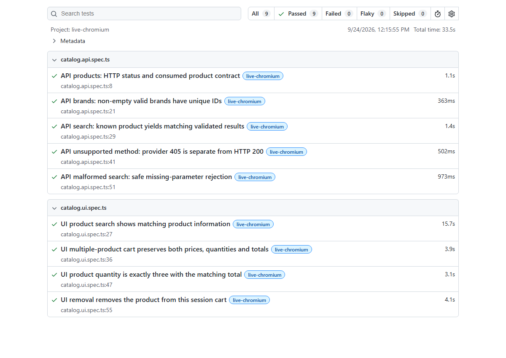

# Playwright Ecommerce Quality Framework

[](https://github.com/stefank3/playwright-ecommerce-quality-framework/actions/workflows/deterministic.yml)

A Playwright and strict TypeScript portfolio framework testing product discovery, session carts and typed API contracts. Required checks run with controlled synthetic inputs; a separate **manual live suite** exercises the shared [Automation Exercise practice site](https://automationexercise.com). Live availability never decides the automatic CI gate.

M1 is reviewed and merged. M2 adds four live UI scenarios and five live API scenarios, with traffic budgets and isolated contexts. Its PR requires independent review before any merge. No accounts, orders, payments or persistent user content are created.

## Start locally

Use **Node 24.21.0 LTS** (`.node-version`) and npm 11. From the repository root, in PowerShell or Bash:

```sh
npm ci
npx playwright install chromium
npm run validate
npm run report
```

On Linux, use `npx playwright install --with-deps chromium` for required system libraries. Setup downloads need network access; deterministic tests deny outbound application traffic. No application server, credentials or environment file is required. See [setup](docs/setup.md) for clone/branch instructions.

## Two testing lanes

| Lane            | Scenario examples                                                                                   | Execution                                           |
| --------------- | --------------------------------------------------------------------------------------------------- | --------------------------------------------------- |
| Deterministic   | Controlled catalog UI/API, malformed contracts, live configuration rejection, transport guard tests | `npm test`; required `npm run validate`; push/PR CI |
| Manual live UI  | Product search; two-product cart with prices/quantities/totals; quantity three; removal             | `npm run test:live:ui` with opt-in                  |
| Manual live API | Products, brands, known search, unsupported method and missing search parameter                     | `npm run test:live:api` with opt-in                 |

Live tests use one worker, zero retries, exact HTTPS host/path allowlists, one-second request spacing, at most 100 dispatches and a five-minute limit. Third-party resources are blocked. Read the [dated policy check, authorization and limitations](docs/live-testing.md) before running. Do not overlap local and CI live runs.

PowerShell, when a live run is authorized:

```powershell
$env:QE_LIVE = 'true'
$env:QE_BASE_URL = 'https://automationexercise.com'
npm run test:live:list
npm run test:live
Remove-Item Env:QE_LIVE, Env:QE_BASE_URL
npm run report:open
```

Bash:

```sh
QE_LIVE=true QE_BASE_URL=https://automationexercise.com npm run test:live:list
QE_LIVE=true QE_BASE_URL=https://automationexercise.com npm run test:live
npm run report:open
```

`test:live:list` makes no target requests. Live execution is never included in `npm test`, `validate`, push or PR CI. The separate live workflow requires manual dispatch and acknowledgment; no schedule exists.

## Architecture and technology choices

- A test-focused modular monolith keeps specs, fixtures, page objects, pure contracts and transport separate; there is no separate ecommerce application or backend.
- Playwright provides Chromium automation, native assertions, isolation and HTML reports. Small products/detail/cart objects encapsulate provider interactions; specs own assertions.
- TypeScript 6.0.3 matches the pinned lint parser's supported range. Type-aware ESLint rejects unawaited assertions; Prettier owns formatting.
- Zod checks consumed response fields while accepting additive provider fields. HTTP status and provider response codes remain distinct.
- Deterministic Node/browser denial and explicit live routing make lane selection fail closed. These are safety controls for maintained tests, not a hostile-code sandbox.
- Exact dependencies and lockfile installation keep the baseline reproducible; M2 adds no dependency.

## Commands and evidence

| Command               | Purpose                                                                                            |
| --------------------- | -------------------------------------------------------------------------------------------------- |
| `npm run doctor`      | Offline runtime/browser/config/output preflight                                                    |
| `npm run validate`    | Formatting, type-aware lint, strict typing, deterministic tests, clean build and repository checks |
| `npm run test:list`   | Deterministic discovery                                                                            |
| `npm run test:debug`  | Guarded Playwright Inspector; direct unguarded CLI/IDE execution fails closed                      |
| `npm run build`       | Safely clear and compile reusable support to ignored dist                                          |
| `npm run report`      | Open `playwright-report/deterministic/index.html` on loopback                                      |
| `npm run report:open` | Open `playwright-report/live/index.html` on loopback                                               |

Reports are generated locally, not committed. Live failure evidence is sanitized status/timing/traffic data; raw live traces, screenshots and cookies are not captured. Ctrl+C stops the report server. See [live execution evidence](docs/live-testing.md) for actual results and limitations, not a guarantee of future passes.

One authorized run on 2026-09-24: **9 passed (5 API + 4 UI), 0 failed/skipped, 33.5 seconds, 31 outbound dispatches**. The image below is a reviewed capture of that generated report, rendered with network disabled; it contains no target page, cookies or response data.



The shared public target can change selectors, products, prices or availability. Blocked ads/images/fonts mean these checks do not establish visual fidelity. Accessibility, Firefox/WebKit, account lifecycle and checkout remain deferred. MIT is intended, but no `LICENSE` exists and no open-source license has been granted; GitHub platform rights to view and fork still apply.

## Documentation

[Setup](docs/setup.md) · [Running/debugging](docs/running-tests.md) · [Live testing](docs/live-testing.md) · [Extending](docs/extending.md) · [Troubleshooting](docs/troubleshooting.md)

[Architecture](docs/architecture.md) · [Test strategy](docs/test-strategy.md) · [Standards](docs/engineering-standards.md) · [Security](docs/security.md) · [Roadmap](docs/roadmap.md) · [Agent governance](AGENTS.md) · [Reviewer contract](CLAUDE.md)
